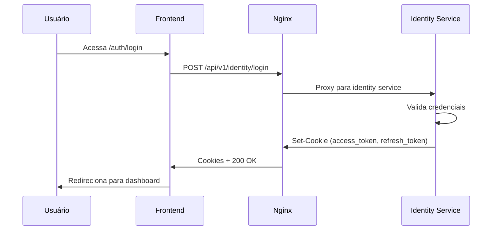
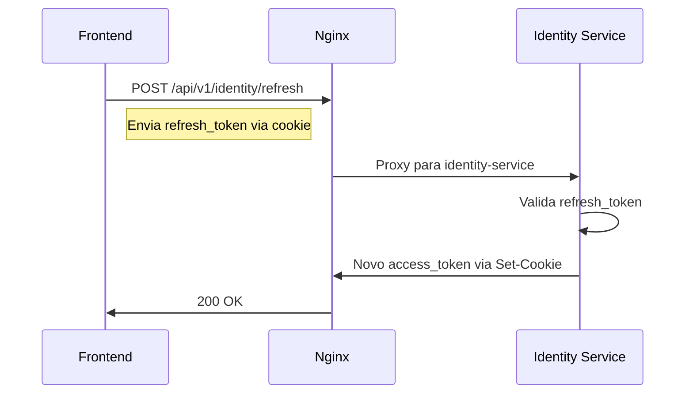

# Fluxo de Autenticação - Gestor-e-Docs

## Visão Geral

O sistema utiliza uma arquitetura de autenticação baseada em JWT (JSON Web Tokens) com dois tipos de tokens:
- **Access Token**: Token de curta duração (15 minutos)
- **Refresh Token**: Token de longa duração (7 dias)

## Componentes

### 1. Frontend (React)
- Rota principal: `/auth/login`
- Cliente HTTP configurado com `baseURL: '/api/v1/identity'`
- Gerencia cookies automaticamente via browser

### 2. Nginx Proxy
- Terminação SSL/TLS (TLSv1.2/1.3)
- Rate limiting: 10 req/min (burst 20)
- Headers de segurança:
  ```nginx
  add_header X-Content-Type-Options "nosniff" always;
  add_header X-Frame-Options "DENY" always;
  add_header X-XSS-Protection "1; mode=block" always;
  add_header Strict-Transport-Security "max-age=31536000; includeSubDomains" always;
  ```

### 3. Identity Service (Go/Gin)
- Base URL: `/api/v1/identity`
- Endpoints principais:
  - `POST /login`: Login de usuário
  - `POST /refresh`: Renovação de token
  - `POST /logout`: Logout
  - `GET /me`: Perfil do usuário

## Fluxo de Autenticação

### 1. Login



### 2. Renovação de Token



## Configuração dos Cookies

### Access Token
```go
Cookie {
    Name:     "access_token",
    Value:    token,
    MaxAge:   15 * 60, // 15 minutos
    Path:     "/",
    Secure:   true, // em produção
    HttpOnly: true,
    SameSite: http.SameSiteLaxMode
}
```

### Refresh Token
```go
Cookie {
    Name:     "refresh_token",
    Value:    token,
    MaxAge:   7 * 24 * 60 * 60, // 7 dias
    Path:     "/",
    Secure:   true, // em produção
    HttpOnly: true,
    SameSite: http.SameSiteLaxMode
}
```

## Segurança

### Headers CORS
```nginx
add_header 'Access-Control-Allow-Credentials' 'true';
add_header 'Access-Control-Allow-Methods' 'GET, POST, PUT, DELETE, OPTIONS, HEAD';
add_header 'Access-Control-Allow-Headers' 'DNT,X-CustomHeader,Keep-Alive,User-Agent,X-Requested-With,If-Modified-Since,Cache-Control,Content-Type,Authorization,Accept,Origin,Cookie';
add_header 'Access-Control-Expose-Headers' 'Set-Cookie';
```

### Rate Limiting
```nginx
# Limite de 10 requisições por minuto com burst de 20
limit_req_zone $binary_remote_addr zone=login_limit:10m rate=10r/m;
limit_req zone=login_limit burst=20 nodelay;
```

## Variáveis de Ambiente

### Identity Service
- `JWT_SECRET_KEY`: Chave secreta para assinatura dos tokens JWT (obrigatório em produção)
- `GIN_MODE`: Define o modo de execução (`release` para produção)
- `SERVICE_PORT`: Porta do serviço (default: 8085)

### Nginx
- Certificados SSL:
  - `/etc/nginx/certs/nginx.crt`
  - `/etc/nginx/certs/nginx.key`

## Recomendações de Desenvolvimento

1. **Ambiente Local**
   - Use HTTPS mesmo em desenvolvimento
   - Gere certificados autoassinados para testes locais
   - Mantenha o rate limiting ativo para simular produção

2. **Testes**
   ```bash
   # Teste de login
   curl -k -X POST https://localhost/api/v1/identity/login \
     -H "Content-Type: application/json" \
     -d '{"email":"user@example.com","password":"password123"}'

   # Teste de refresh
   curl -k -X POST https://localhost/api/v1/identity/refresh \
     -b "refresh_token=<token>"
   ```

3. **Depuração**
   - Verifique logs do nginx para erros de CORS/SSL
   - Use as ferramentas de desenvolvedor do navegador (aba Network)
   - Monitore tentativas de login falhas

## Boas Práticas

1. **Segurança**
   - Nunca armazene tokens JWT no localStorage
   - Sempre use HTTPS em produção
   - Mantenha o `JWT_SECRET_KEY` seguro e único por ambiente
   - Implemente monitoramento de tentativas de login falhas

2. **Performance**
   - Mantenha o rate limiting configurado
   - Use cache quando apropriado
   - Monitore tempos de resposta

3. **Manutenção**
   - Atualize dependências regularmente
   - Monitore expiração de certificados SSL
   - Faça backup regular do banco de dados
